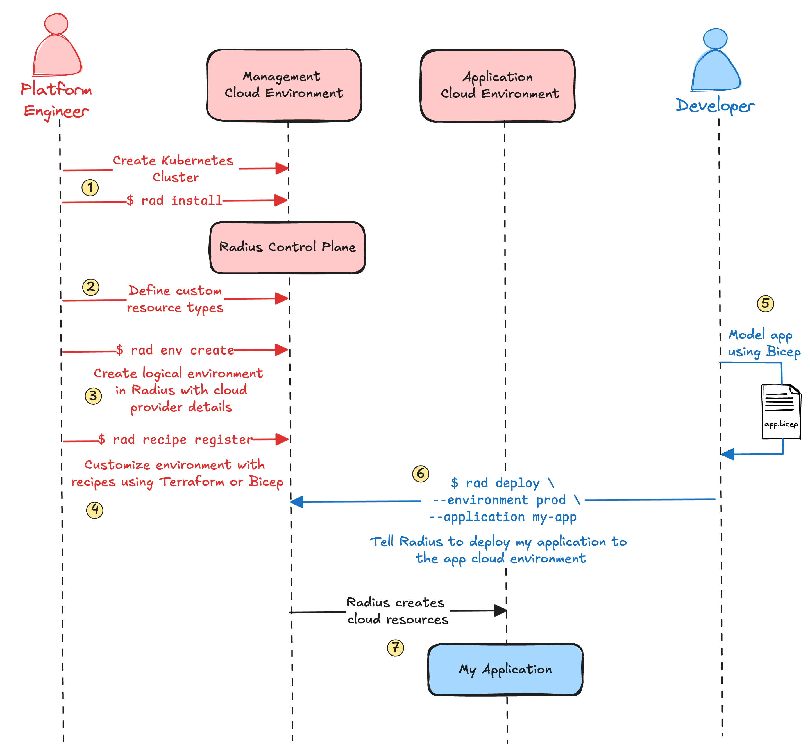
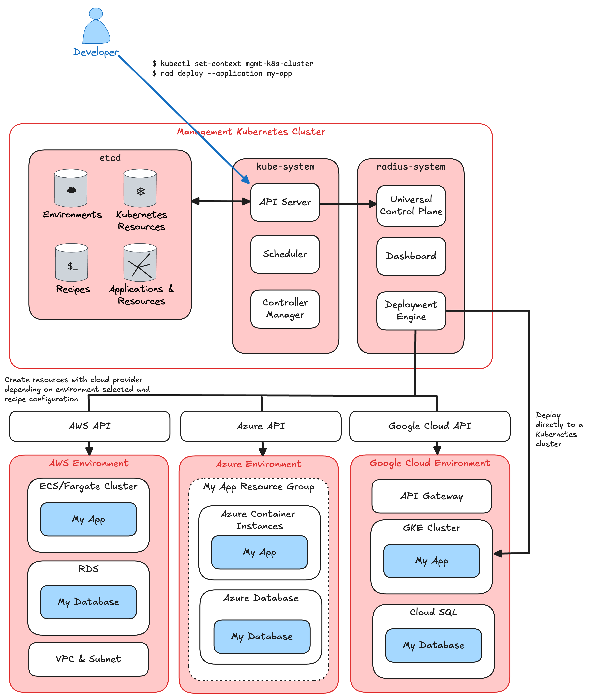

I recently joined the Azure Incubations team at Microsoft. In addition to Radius, the Azure Incubations team has helped build several open-source projects including [Dapr](https://dapr.io/), [KEDA](https://keda.sh/) and [Copacetic](https://project-copacetic.github.io/copacetic/website/) all of which are CNCF projects. [Drasi](https://drasi.io/) is the team's latest project which was just submitted to CNCF. Before joining the team, I knew very little about Radius aside from watching [Brendan Burns and Mark Russinovich talk about it](https://www.youtube.com/watch?v=gaG77PiYv5w). Over the last six weeks I've learned a lot about how Radius is built, what it can do today, and what is in store for the future. I suspect many readers of this blog are new to Radius just like I was, so let me share with you what I have learned.

## Platform engineering landscape

I've been working with large organizations for many years helping them adopt cloud-native technologies—mostly managing Kubernetes and serverless infrastructure. Each week, I try to talk with at least one large organization in order to keep a pulse on what challenges are top of mind in the community and what engineering efforts are a priority. I've observed several things about the platform engineering landscape recently.

**The internal developer platform is becoming standardized** – Internal developer platforms have existed for many years. These platforms shield developers from having to know cloud infrastructure and Kubernetes in-depth as well as to provide CI/CD and observability capabilities. Internal development platforms have become more important as organizations prioritize enforcing security requirements and driving standardization and efficiency. The CNCF platform engineering landscape has also matured. Projects like Backstage, Crossplane, ArgoCD, Flux, and Terraform are popular building blocks. KubeCon now has several co-located events including ArgoCon, BackstageCon, and Platform Engineering Day. And projects like [Cloud Native Operational Excellence](https://cnoe.io/) are starting up to help standardize how internal developer platforms are built.

**No common definition of an application** – Surprisingly, most cloud-native tools do not have a concept of an application. In Kubernetes, for example, we rely on basic labeling of resources such as `app.kubernetes.io/name: myapp`. Without a clear definition of an application, it is near impossible to have a consistent contract between developers and platform engineers. Some organizations try to hide infrastructure complexity behind CI/CD systems or custom tooling, but often, infrastructure details leak into the developers' world.

**Cloud is more than Kubernetes** – Kubernetes is great, but one thing it does not do is make it possible to manage applications which use cloud services running outside of Kubernetes such as managed databases, message queues, etc. Teams are often using a mixture of Kubernetes tooling, basic label functionality in Kubernetes, and infrastructure as code tools for managing their applications.

**Containers don't just run on Kubernetes** – Standing up and operating a production-ready Kubernetes environment is not easy and for many organizations it can be overkill. There are many easier-to-operate container platforms such as Azure Container Instances, Azure Container Apps, Amazon ECS/Fargate, and Google CloudRun. I've talked with a growing number of organizations that are moving from Kubernetes to non-Kubernetes container platforms for lower operational overhead and greater ease of use. The opposite is true as well. Many organizations move from one of these platforms to Kubernetes because they want to take advantage of the Kubernetes ecosystem and are ready to make the investment in an internal developer platform and to setup and operate Kubernetes. Since it takes a significant amount of effort to move between these platforms, engineering teams are making long-term, difficult to reverse, platform decisions well before they have built their application, much less operated it in production.

With these trends and challenges in mind, I've begun to understand what makes Radius unique.

## What makes Radius unique

After getting some hands-on time, talking with a few platform engineering teams, and getting a tutorial from a few Radius maintainers, I've built up my own understanding of what makes Radius unique. I summarize it as: *Radius is an application-centric, platform-agnostic, cloud resource manager which decouples developer's applications from platform engineer's cloud infrastructure*. That's a mouthful—let's unpack that ignoring for a moment what is possible today and what is on the roadmap. I will discuss what is possible today and what is on the roadmap later.

**Application centric** – Unlike similar tools, Radius is application centric. Rather than having to know cloud platform-specific details, developers build their application using a set of application building blocks published by the platform engineering team. These building blocks are called resources in Radius, but we will refer to them as application resources for now. Application resources are distinctly different from infrastructure resources from a cloud provider. They can be simple application components, such as a web service or a database, or they can be complex applications such as a *highly available auto-scaling web service with an API gateway, database, and memory cache*. Radius ships with basic application resource types today, but the most interesting resource types will come from community contributors or developed in-house to meet organizational-specific needs.

Since Radius has deep insight into each application, Radius can track dependencies between applications and application components. If you have ever operated a complex landscape of applications and infrastructure, you know how hard it is to understand dependencies. A single database outage can cause a ripple effect through multiple applications and affect many different business functions. When developers use Radius to model their application, Radius keeps track of connections between cloud resources and between other applications. This enables Radius to show operators an application graph showing dependencies across the entire landscape. This graph can be used to identify business impacts of even the smallest component outage and enrich data in incident management and observability systems.

**Platform agnostic** – Radius enforces separation of duties between platform teams and application developers. The application implementation is decoupled from the infrastructure implementation. Since the contract between developers and cloud environments is defined by a set of application resource types published by the platform engineering team, and not by which cloud provider is being used, Radius makes applications highly portable both between different cloud providers and between different container platforms.

**Cloud resource manager** – When Radius deploys an application, it translates the application resources used by developers into infrastructure resources. This translation is handled by Recipes in Radius. Each application resource type has a Recipe which specifies how to deploy and run that resource. Since recipes are implemented using Terraform or Bicep modules, they are very flexible. They can be composed of almost any infrastructure resource such as containers, managed databases, VPCs and VNets, load balancers, or any other cloud service from Azure, AWS, or in the future Google Cloud.

Recipes become powerful when combined with Radius environments. Developers can choose which environment to deploy their application to with Radius. These environments are created by platform engineers and point to a cloud provider and region. Each environment has a unique set of Recipes. The platform engineer can configure, for example, a set of Recipes for a production environment which deploys an Envoy proxy with mTLS enforced, storage encryption, and other production requirements. Then the Recipes for the test environment, would not need these production security controls. The configuration of the application and cloud infrastructure when the application is deployed depends entirely on which environment is selected. The developer never has to modify their application definition or code or have intimate knowledge of the cloud environment.

## System architecture

I'm fortunate enough to have had plenty of time to get hands-on with Radius. I will try to explain my understanding of the system through a series of diagrams.

### Usage workflow

Radius enforces a clear separation of duties between developers and platform engineers. You can see in the diagram below that the platform engineer has defined the resource types, created an environment, and configured environment-specific Recipes. The developer then uses those resource types to model their application.

**Steps 1–4:** The platform engineer installs Radius on a Kubernetes cluster (Radius runs on Kubernetes today, but it is designed to have other deployment options in the future). Then he or she configures the resource types developers will use, the environment applications will be deployed to, and the Recipes which implement how each resource type is deployed in that environment.

**Steps 5–6:** The developer uses the resource types to build his or her application. Once the application has been defined in a Bicep file, the developer can use the Radius CLI to deploy the application to one of the environments or rely on their [GitOps CI/CD pipeline](https://github.com/radius-project/design-notes/blob/main/tools/2024-06-gitops-feature-spec.md).

**Step 7:** Radius then uses the application definition from the develop and the Recipes from the platform engineer to create resources and deploy the application to the selected environment.

As you can see, Radius gives platform engineers the tools to define a clear contract with their developers via resource types. Recipes give them full control of the underlying infrastructure without having to expose those details to developers. Developers then have self-service access to deploy their application without needing knowledge of Kubernetes or a specific cloud provider's APIs.

### Logical data model

The diagram below is a conceptual representation of the various Radius objects and how they are related. It is simplified from the actual implementation to make it easier to understand.

**Application** – This is a Radius object representing an actual application. Radius is not opinionated about how you define an application so it's up to you. It could be a microservice or a complex set of containers, databases, message queues, etc.

**Resource** – A resource is an application component which is requested in the application's definition. Developers use resources to model their application. Each resource has a type and a version.

**Resource type** – Radius ships with several [resource types out of the box](https://docs.radapp.io/guides/author-apps/portable-resources/overview/) such as `Application.Core/containers` and `Application.Core/mongoDatabases`. It could be a resource type you have added to your Radius configuration from another community member, or a resource type you have defined and customized for your organization.

**Recipe** – We covered Recipes quite a bit in the previous section. Remember that Recipes translate resources such as `Application.Core/containers` into deployable infrastructure components such as Kubernetes deployment. Radius ships with Recipes for managing out-of-the-box resource types for local development and on each cloud provider.

**Environment** – Environments are straight forward. They are a single place to run applications and all the supporting services. An environment can be your local workstation, an Azure subscription, an AWS account, or a Google Cloud project. You can organize your cloud provider environments the same or completely different than the Radius environments, e.g., one of more Radius environments can use the same Azure subscription or AWS account.

**Resource group** – If you are an Azure user, you may be familiar with Azure resource groups. Radius takes inspiration from these resource groups, and Radius' resource groups are similar. Radius resource groups are a logical grouping of applications and their resources. When you deploy an application with Radius, you choose which resource group to place it in. In the future, resource groups will have their own RBAC rules, so you will be able to group applications together with a shared set of permissions.

**Connection** – Earlier, I talked about the benefits of Radius to operational teams because it tracks dependencies. Connections are how those dependencies are modeled. Each connection denotes which parent resource is connected to, or depends upon, which source resource.

### Deployment model

One of my first questions was what does a Radius deployment look like? The diagram below shows a management environment where Radius runs and several application environments. In this example, Radius deploys applications to AWS, Azure, and Google Cloud. Each cloud environment can be configured differently using recipes. You can see that in AWS, Radius is deploying the application to ECS/Fargate, creating an RDS database, and configuring the VPC. In Azure, Radius is creating a resource group for the application, then deploying it using Azure Container Instances and Azure Database. Finally, in Google Cloud, Radius is deploying the application using the Kubernetes API to a GKE cluster and creating a Cloud SQL database and API Gateway.

Remember that in all three of these deployment scenarios, the developer never has to know these details. The application and the application definition never changes. It is the platform engineer who configures the recipes for each cloud environment.

In addition to deploying the application's containers and databases, recipes can also be used to configure IAM, storage encryption keys, firewall rules, etc. Recipes can be used to tag resources with application metadata to enable cost attribution for example. Since Radius uses Terraform and Bicep to deploy resources, it is up to you how complex you want to make your recipes.

There are a few other interesting, non-obvious things about how Radius is deployed. You will notice that when the user deploys the application, the Radius CLI makes an API call to the Kubernetes API server for cluster running Radius. This is because Radius uses the [Kubernetes API aggregation layer](https://kubernetes.io/docs/concepts/extend-kubernetes/api-extension/apiserver-aggregation/). This means that the Kubernetes API server proxies API calls to Radius' control plane running on the same cluster. This also means that identity and RBAC is handled by Kubernetes. When you deploy an application using Radius, the Radius control plane (called the Universal Control Plane) creates applications and resources which are stored in the same etcd as the Kubernetes control plane.

## Radius roadmap

So far, we have ignored what is possible today and what is coming. There are several features discussed here which are not available today, but are on the roadmap including:

- The ability to define your own resource types is very basic today. Developers can use the [extender resource type](https://docs.radapp.io/reference/resource-schema/core-schema/extender/) and specify their own recipe. But this breaks the hard separation between developer and platform engineer since the developer is specifying the recipe. The ability to specify types beyond the extender type is under development now. You can read more in the [user-defined types technical design](https://github.com/radius-project/design-notes/blob/main/architecture/2024-07-user-defined-types.md).

- Radius will only deploy containers to the same Kubernetes cluster that is running Radius today. The ability to deploy to [other Kubernetes clusters](https://github.com/radius-project/roadmap/issues/42) and to other [serverless container platforms](https://github.com/radius-project/roadmap/issues/23) are on the roadmap.

- Radius can only deploy to a local developer workstation, Azure, and AWS. Support for Google Cloud is on the [roadmap](https://github.com/radius-project/roadmap/issues/38).

- While you can use Terraform and Bicep to deploy cloud resources today, we are implementing several enhancements to make deploying resources more powerful and flexible including using Dapr workflows as part of your recipe.

You can monitor the Radius roadmap on the [Radius GitHub](https://aka.ms/radius-roadmap) page.

## What's next

If you want to learn more about Radius, one of the best resources is the monthly Radius community call. Each call has a demo by one of the contributing engineers. Here is a set of deep links to some of the best demos:

- [Introductory demo](https://youtu.be/EfGAwli5W4U?si=Wq8S74iUX5iKNVaG&t=1665) (29 minutes)
- [Recipes](https://youtu.be/DtZnb-uD84I?si=Fj0Hl1GOKGTTaR8T&t=780) (19 minutes)
- [Radius dashboard](https://youtu.be/JIATTuvsXCs?si=DIp_Spp2OlWCGVkv&t=1500) (9 minutes)
- [Dapr](https://youtu.be/DtZnb-uD84I?si=59xPFH4gV_FavfL1&t=2211) (16 minutes)
- [Terraform submodules](https://youtu.be/JDYmY1IRVOs?si=tw6nbpOhgoJsGKYs&t=659) (7 minutes)
- [Azure workload identity](https://youtu.be/6u014xn_tDA?si=bRkSPkdzuB7i4Bua&t=665) (11 minutes)

I hope this blog post was helpful for others new to Radius. If you have ideas or want to get involved in the project, visit the [Radius Community](https://github.com/radius-project/community/blob/main/README.md) page to learn about our community calls and Discord channel.
