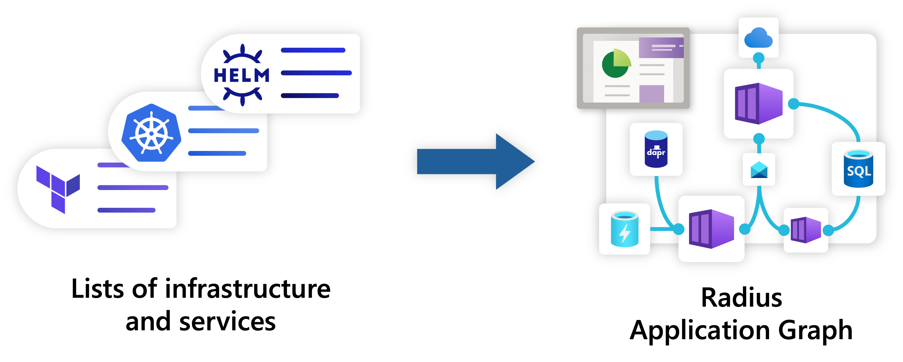
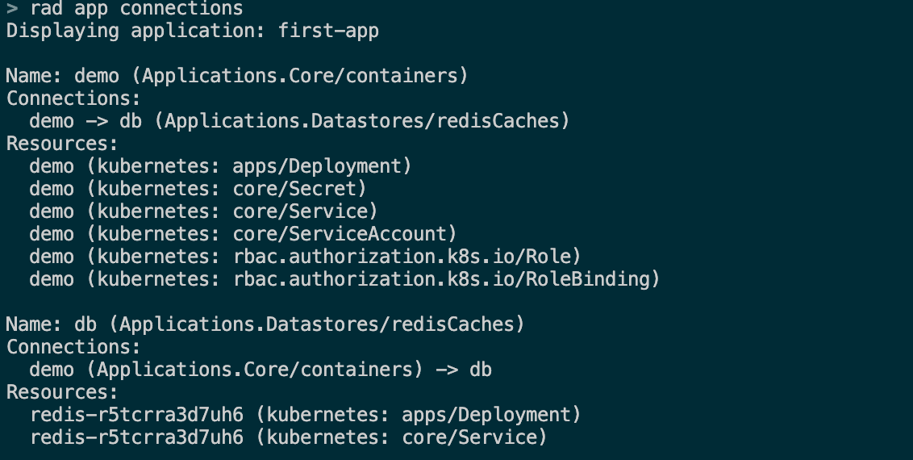
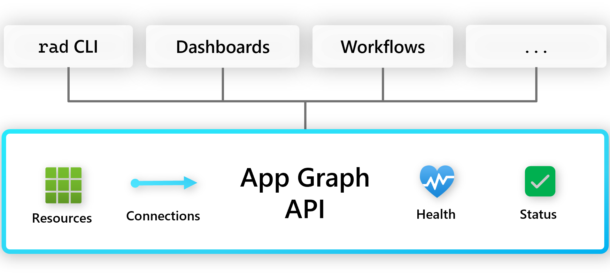
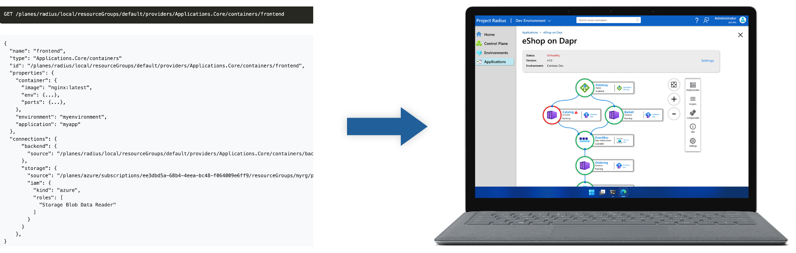

In the complex landscape of cloud native architectures today, it can be difficult to understand how all the pieces of an application fit together. A single application can be composed of many different microservices, each with their own resources, dependencies, and relationships. Typically represented as lists of resources making up the application, these relationships can be difficult to visualize, and even more so if architectural design documents are lacking or out of date. Although engineers know all too well that applications are so much more than just Kubernetes and flat lists of resources, creating and maintaining a consistently up-to-date catalog of application components is a tall order for any organization.

## Application graph data that is inherently part of the development process

With an application structure that includes environments, resource groups, and connections, applications deployed using Radius get represented into a graph-like data set that reveals precisely how the resources within the application are interconnected. Operator teams that support developers are thus empowered to build visualizations using this graph data that help them intuitively understand what makes up an application. Best of all, this data is generated automatically as part of the development process with Radius inherent in the application declarations, so it is always up to date without requiring additional effort from developers.

## View application graph relationships with the Radius CLI

Using Radius to declare [connections](https://docs.radapp.io/guides/author-apps/containers/overview/#connections) between dependencies to simplify the provisioning and deployment of resources directly results in the documentation of the application. These resource and connection declarations are used by Radius to construct the application graph data. The Radius CLI provides a lightweight `rad app connections` command to view the application and its connections in a terminal window. This provides developers and operators with a way to quickly understand how the application is structured and how its resources are connected while they are building their applications.

## Build visualizations using the Radius application graph API

Instead of multiple views of logs, infrastructure, and code, Radius provides a single source of truth for the application. The application graph API provides a way to query the application graph data and build visualizations that help teams understand how their application is structured and how its resources are connected. Radius provides an HTTP-based API that allow users to communicate with its control plane to query for the application graph data. The API can be hosted inside a Kubernetes cluster or as a standalone set of processes or containers. Visit the [Radius API documentation](https://docs.radapp.io/concepts/api-concept/) pages to learn more.

 