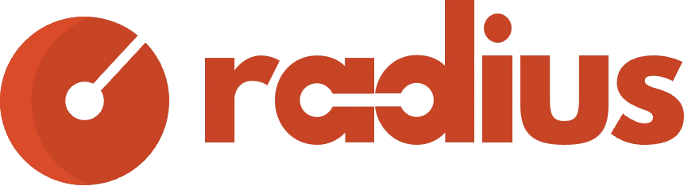
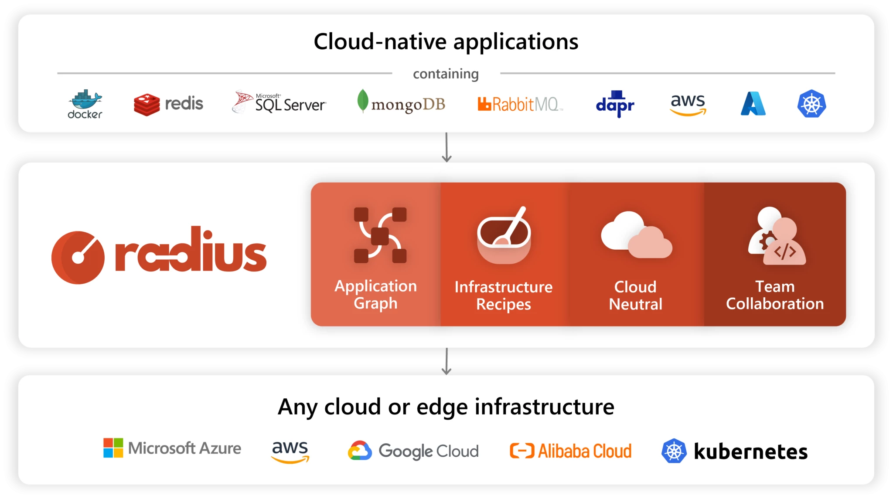
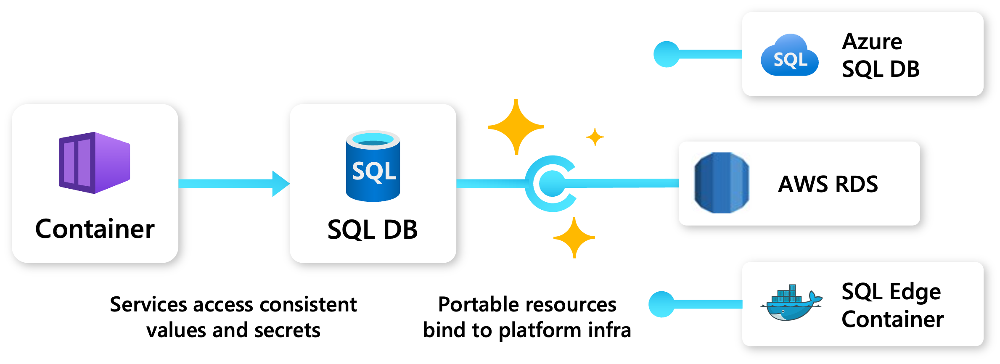
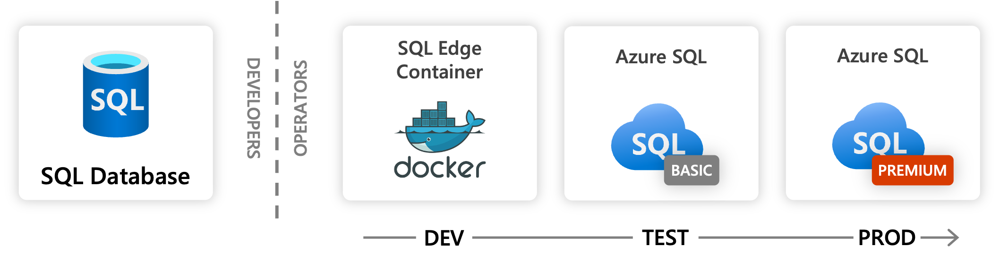
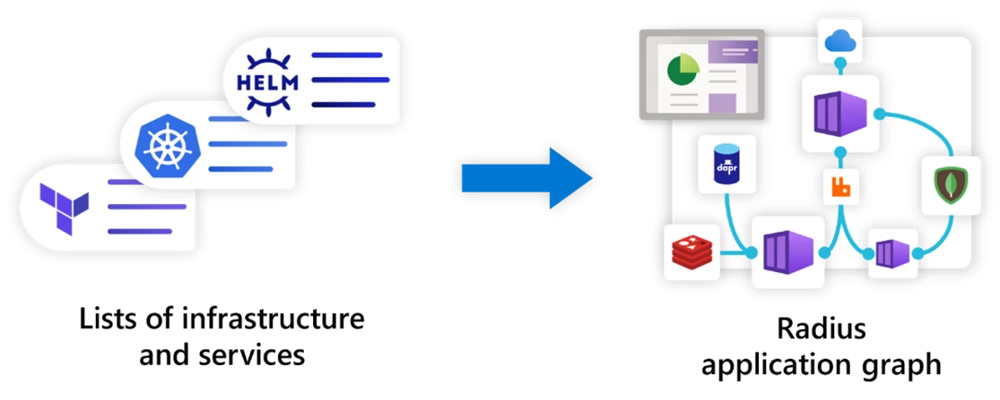

# Enabling developer collaboration with Radius

Developers and IT operators today know all too well the pain involved with deploying, managing, and making sense of applications in an ever-evolving and increasingly complicated cloud-native landscape. While it’s true that advancements in cloud infrastructure and platforms like Kubernetes have been gamechangers for developing flexible, scalable, and portable microservice applications, they have also made things more challenging for developers and operators alike. For developers, the complexity of managing infrastructure and lack of visibility into the resources that make up their applications are major roadblocks for productivity. For operators, the lack of standardization and automation in the deployment process can lead to loss of control over the infrastructure, and degradation of confidence in the applications that are deployed. At the end of the day, development teams are left with a disjointed experience between platforms and cloud providers. Developers and operators alike find themselves struggling to make sense of how their application comes together across disparate sets of tools that provide little more than a list of their deployed artifacts.  

Applications are, of course, so much more than just Kubernetes and flat lists of resources. The Microsoft Azure Incubations team is excited to [announce](https://aka.ms/radius-announce) a new open application platform called Radius that places the application at the center of every stage of development—redefining how applications are built, managed, and understood. With features like Recipes and Connections that standardize deployments and automate resource provisioning, Radius provides a centralized toolset for developer and operator teams to effectively collaborate. And because the relationships between resources are inherently captured in application authoring and deployment activities, Radius enables a comprehensive view into an organization’s architecture via its application graph data. Furthermore, Radius is open-source and multi-cloud from the start, allowing for applications that can be written once and, using the same toolset and workflows, deployed to any cloud or on-premises infrastructure. To get started or learn more about Radius, visit [radapp.io](https://radapp.io/), join the discussions on [Discord](https://aka.ms/radius/discord), or dial into an upcoming [community meeting](https://github.com/radius-project/community).

## A single tool to describe, deploy, and manage your entire application

Radius is focused on solving platform engineering challenges involved in supporting application deployments across on-premises infrastructure and cloud providers like [Microsoft Azure](https://azure.microsoft.com/en-us) and Amazon Web Services. Meeting developers and operators where they are today, Radius offers built-in support for some of the most popular app development tools like Dapr, and infrastructure as code (IaC) languages like Terraform and Bicep. Designed to fit into, rather than disrupt, existing development tasks and CI/CD pipelines, Radius works to help developers better understand all the components that comprise their applications and takes care of platform configurations like permissions, connection strings, and more to simplify their tasks. As a result, operators can ensure that all applications are deployed in compliance with organizational policies, then use Radius to manage the application and its resources.

## Radius features available in this first open-source release

In this first release, the focus is on the features that are most foundational to the Radius platform and its goals of improving the productivity of application development workflows. These include:

- **Simplified and consistent application development experience:** Deploy to any cloud provider or on-premises using the same application definition, all with a consistent set of tooling and experience. These include capabilities to automate resource access and provisioning, as well as the ability to configure environments that meet the needs of each phase of development.
- **Recipes and environments:** Standardize and scale deployments with clear separation of concerns between developers and operators. Radius Recipes are pre-definable templates that automate the provisioning of infrastructure resources and environment configurations that can be designed to adhere to cost, security, and compliance standards.
- **Application graph:** Gain visibility into the resources and relationships that make up an application. Radius captures the relationships between resources in an application as a part of the development activities, which can in turn be queried and understood.

## Consistent experience across platforms, cloud providers, and on-premises

To meet the growing business and technical needs for multi-cloud architectures, applications defined and managed with Radius can be deployed and run on any cloud using the same set of tools, meaning that the application code, definitions, and development workflows remain consistent. Agnostic to whether the application is deployed to Azure, AWS, or on-premises the authoring, deployment, and management experience remains the same. Furthermore, Radius makes it easy to connect and leverage many popular services such as Redis, Mongo, Dapr, and SQL, with more to be added as the needs and requirements of the community grows.

For example, imagine an application that leverages a Mongo database. When running locally, the developer may want to use a Mongo container and when running in production, operators may want to enforce the use of high-throughput databases. With Radius, developers can model a Mongo resource in their app and use its connection string during their development and testing stages. When it comes time to deploy in production, developers can swap their application resources by changing just their app definition connections to services like [Azure CosmosDB](https://azure.microsoft.com/en-us/products/cosmos-db/) or AWS DocumentDB that have been pre-configured by operators. In other words, changing the backing infrastructure for an application in Radius no longer requires app code or configuration changes.

## Automate environment configurations and resource provisioning with Recipes

Collaboration between developers and operators today requires detailed coordination, resulting in back-and-forth manual processes that slow down development velocity. Most organizations have resorted to building custom pipelines or ticketing systems for infrastructure deployments, but these only ease part of the pain without addressing the core need for manual processes. This is where Radius Recipes adds new value: operators are able to configure IaC templates (Terraform modules and Bicep files) that developers can use for self-service resource provisioning and deployments. Recipes also allow operators to define and enforce corporate policies, such as which cloud resources can be used, how they are configured, and who can deploy them. This means that developers no longer need to worry about the details involved in deploying appropriate infrastructure when building out their applications, allowing them to focus on writing application code.

For example, an operator can define a Recipe that deploys a Redis cache that meets the production requirements of their organization: minimum of two nodes and a minimum of two replicas. The operator can also specify that the Redis cache must be deployed to a specific region and be pre-configured with the correct connection string and necessary credentials. Once the Recipe is defined, developers can use it to deploy a Redis cache without having to worry about the details of how to deploy it, or whether it is configured correctly. This separation of concerns enables operator teams to scale their support for developer teams, while ensuring that applications are deployed in compliance with organizational policies.

## Manage infrastructure leveraging the Radius application graph

One of the biggest challenges of managing cloud-native applications is ensuring that the cloud infrastructure used by applications meets cost, operations, and security requirements. However, IT operators are often in the dark when it comes to having a clear and accurate representation of the deployed application resources, limiting their ability to effectively manage their corporate infrastructure. Radius introduces an application structure that includes environments, resource groups, and connections, resulting in an application graph that shows precisely how the application and its infrastructure are interconnected, enabling teams that support developers to build views and intuitively understand what makes up an app. Furthermore, Radius integrates with popular infrastructure tools like Terraform, and existing CI/CD systems like GitHub Actions to provide a seamless operator experience.

## Learn more and contribute 

Fully committed to achieving industry-wide impact via open-source, the maintainers are in the process of submitting Radius as a new project to the Cloud Native Computing Foundation (CNCF). Enterprises like Microsoft, BlackRock, Comcast, and Millennium BCP have already been working together to ensure Radius evolves along with the broader cloud native community. The Radius maintainers are excited to continue collaborating with the open-source community to grow its feature set and welcome all contributions from the community.

We’re looking for people to join us!  To get started with Radius today, please see:

- Learn more from the [documentation](https://radapp.io/).
- Explore the open-source [code repositories](https://github.com/radius-project).
- Engage with the [community](https://aka.ms/radius/discord).