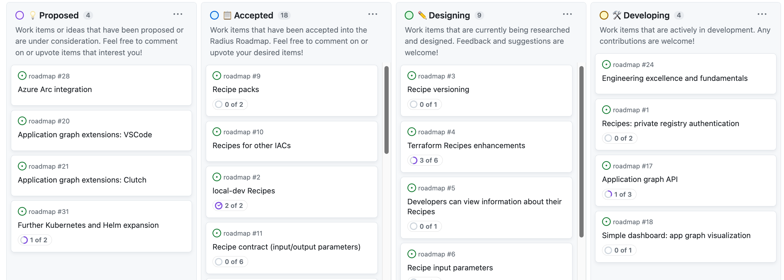

The Radius project maintainers are excited to share our feature roadmap for Radius! We are looking forward to working with the community to grow and enhance Radius and will keep this roadmap updated as we make progress. To remain agile and adaptive to community needs, after each release we will reassess and update the roadmap as necessary to reflect the latest priorities. Please engage with the Radius community via the [monthly community calls](https://github.com/radius-project/community?community-meetings) and [Discord](https://aka.ms/radius/discord) if you have any feedback, suggestions, or feature requests!

Follow the [**Radius backlog**](https://github.com/orgs/radius-project/projects/8/views/1) for updates on the full set of roadmap priorities.

## Immediate priorities

At this stage of the project, building an active and diverse open-source community for Radius is our top priority and we will focus on work that accelerates the growth of our community and adopters. Items like testing, pipelines, automation, and bug fixes that make life easier for open-source contributors will be prioritized. In terms of feature work, we are investing in what our community and users have identified as our most strategic areas: Recipes, Dashboard, connecting to existing resources, and serverless integrations. Below we'll discuss the top priority areas and features for Radius in more detail.

### Radius Recipes

We believe Recipes to be one of the the highest value propositions of Radius, because they enable separation of concerns across developers and operators. The initial public release of Radius offers end-to-end Recipe deployment and deletion for both Bicep and Terraform templates. This unlocks a basic resource lifecycle for learning about and leveraging Recipes in simple applications. For Recipes to become a production-grade feature, there are a set of items we need to design and implement, with the following being our current priorities:

- **Private Terraform modules**: Today Radius only supports public Terraform modules. The first addition to Terraform Recipes we need to add is support for private modules from the Terraform module gallery or from other private galleries.
- **Recipe “stickiness” and versioning**: Operators need to be able to update & make changes to Recipes within an environment. Today this requires any resource using the Recipe to immediately start using the new Recipe template/version upon the next deployment. This may break developers not expecting changes to their infrastructure. We need a way to make this configurable, where teams can control how new Recipe templates are rolled out, along with a versioning strategy.
- **Ability to configure which drivers are supported**: There has been some feedback around being able to selectively disable specified Recipe drivers, e.g. disable Bicep or Terraform Recipes per IT policies. Given the compliance-related nature of this ask, we have prioritized it.
- **Recipes for any Resource**: Today we only support portable resources (Applications.Dapr, Applications.Datastores, Applications.Messaging) for Recipes. As part of our Recipes enhancement, we want to support any resource across Azure, AWS, and more. This would allow operators to define a template for something like an S3 bucket and the developer can request “an S3 bucket” without knowing the details.

### Radius Dashboard

The Radius application graph is a key differentiator and value proposition for Radius, but one that can only be fully realized through a Dashboard offering. Today we have [`rad app connections`](https://docs.radapp.io/reference/cli/rad_application_connections/) functionality in the CLI to list the connections and resources in a Radius application, which is useful but barely scratches the surface of what's possible. Thus, we have prioritized work to deliver a Radius Dashboard that enables users to visualize their Radius application graphs. As a start, will build and make available the API for users, along with a basic implementation of an application graph visualization in a lightweight Dashboard deployed alongside the Radius control plane. We will also explore Backstage and their plugins framework as a part of the Dashboard implementation, as we see great value in leveraging and perhaps collaborating with their well-established community and user base.

### Connecting to existing resources

The Radius vision includes the capability to connect to existing resources that were previously provisioned and existed outside of the scope of the Radius application. The most immediately prioritized work is to enable Radius to connect to such existing pre-provisioned resources using Recipes.

### Serverless integrations

Given the importance of serverless infrastructure in the modern application landscape, it is a priority for Radius to support serverless resources. The initial expansion will focus on integrating with an unopinionated serverless infrastructure platform, specifically [Azure Container Instances](https://azure.microsoft.com/en-us/products/container-instances/), before exploring integrations with more opinionated serverless platforms like [Azure Functions](https://azure.microsoft.com/en-us/services/functions/), [Azure Container Apps](https://azure.microsoft.com/en-us/services/azure-container-apps/), and [AWS Lambda](https://aws.amazon.com/lambda/).

## On the horizon

There is a lot of other work in the backlog that will ultimately be high value to Radius users, but is less time critical than the immediate priorities above that we have frontloaded. The following are some of the features on the Radius roadmap, but are not yet prioritized for the immediate future.

### Further Recipes enhancements

- **Shared infrastructure**: Today a Recipe can either deploy all the infrastructure it needs, or existing infrastructure can be passed in as a parameter. The latter allows for shared accounts/servers with unique databases/tables. For example, an enterprise wouldn't want to spin up 20 CosmosDB accounts each with a single database. Further, an enterprise wouldn't want to spin up a CosmosDB account, SQL Server, and more just in case one of their developers might want to use one of the Recipes in an environment. We need a way for a “create if not exists” functionality to deploy a shared piece of infrastructure when it's first needed. On the flip-side a “delete if not used” capability is also needed for cleanup.

- **Recipe packs**: Today Recipes are individually managed. Installing multiple Recipes at a time requires scripting the `rad` CLI or listing each individually in the environment's Bicep definition. We need a packaging mechanism to bundle related Recipes and version them, allowing organizations to share their Recipes, either private or public, with Radius users.

- **Expand Recipe experience**: We currently provide Recipe support for Bicep and Terraform, but there is opportunity to expand Recipes experience to other IaC technologies, like Script and Helm.

- **Recipes for Gateways**: Today we've “hard-coded” the mapping between a Radius Gateway and the Contour HttpRoute Kubernetes objects. This got us up and running with gateways and allowed offer basic internet-facing routing and termination. Customers have provided feedback that they want to use other ingress controllers (Nginx, Kong, Traefik, Azure Application Gateway) or customize how the underlying Kubernetes/Azure objects are created. Recipes present the perfect concept for managing how Gateway infrastructure is created.

- **Recipes for user-defined types**: Further customization to allow for user-defined types in Recipes.

### Further Dashboard enhancements

Beyond the Application Graph API and simple dashboard via Backstage plugin, we would like to deliver additional Dashboard capabilities. These features tracked in our backlog include additional extensions for other developer tools like VSCode, other Backstage plugins for Recipes, Resource Provisioning, etc.

### Dapr integration into control plane

Improving observability and security of the Radius control plane itself includes adding more logging and metrics such as support for dependency service tracing and monitoring. Given that Dapr may offer many of these enhancements, we are inclined to integrate Dapr into the Radius Control Plane. We'll continue to gather the needs from the community to determine what other observability functionality is needed for using Radius in production scenarios.

### Expanding AWS support

The current implementation of AWS support is an important first step towards modeling AWS as a first-class citizen in Radius' multi-cloud strategy. We would like to further expand AWS support with additional key features, including support for non-idempotent AWS resources and for AWS Identity and Access Management (IAM).

### Identity management

Today, Radius leverages the same identity and credentials as those used to authenticate into accounts when the user registers a cloud provider via their respective CLIs. However, we often receive questions and even desire from users to be able to specify more explicit and precise RBAC policies within Radius.

### Azure Arc integration

[Azure Arc](https://azure.microsoft.com/en-us/products/azure-arc/) is a set of technologies that extends the Azure platform to on-premises, multi-cloud, and edge environments. It allows customers to build applications and services with a consistent development, operations, and security model. It also enables customers to have a central, unified, and self-service approach to manage their Windows and Linux Servers, Kubernetes clusters, and Azure data services wherever they are. There has been interest expressed by the community and users for Radius and Azure Arc integration.

### `rad` CLI enhancements

Although the rad CLI is in a state that's useful for users beginning to build with Radius, there are some functionality gaps that need to be filled (e.g. lack of credential validation, environment scoped operations, etc.). The team will closely monitor community feedback and prioritize CLI functionality as appropriate.

### Expand Kubernetes and Helm integrations

The first iteration of a Kubernetes Interop layer provides functionality to leverage Kubernetes YAML, PodSpec, and Helm Charts to deploy Radius-aware applications such that features like Connections, Recipes, and Application Graph can be incrementally adopted into an existing application. The Radius maintainers are closely monitoring feedback and issues coming from the community to expand on these features as necessary.

### Terraform provider

Radius currently supports Terraform in Recipes but does not have a dedicated Terraform Provider, which means Radius resource definitions must still be in Bicep. So far, the community has not expressed strong feedback about this limitation, but the Radius maintainers will continue monitoring to determine if deeper Terraform integration will be necessary.

### Application model maturation

There are aspects of the Radius application model that we need to build upon, including support of sidecars, more standard resources like PostgreSQL, autoscaling of applications, etc. These enhancements will be prioritized based on community feedback and user need.

### Universal Control Plane improvements

There are a few planned enhancements to the Radius Universal Control Plane (UCP), including UCP Proxy and memory/CPU optimizations, which will be prioritized based on feedback and need.

## Learn more and contribute

The Radius maintainers are excited to continue collaborating with the open-source community to grow its feature set and welcome all contributions from the community.

We’re looking for people to join us!  To get started with Radius today, please see:

- Learn more from the [documentation](https://radapp.io/).
- Explore the open-source [code repositories](https://github.com/radius-project).
- Engage with the [community](https://aka.ms/radius/discord).