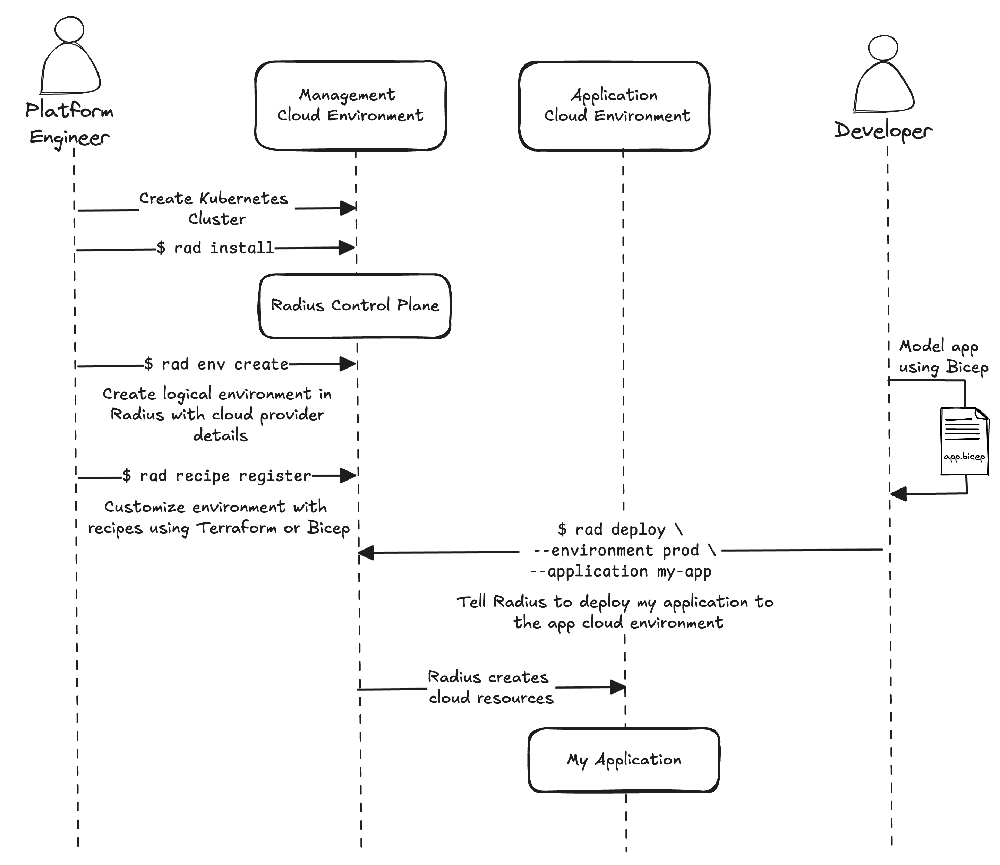
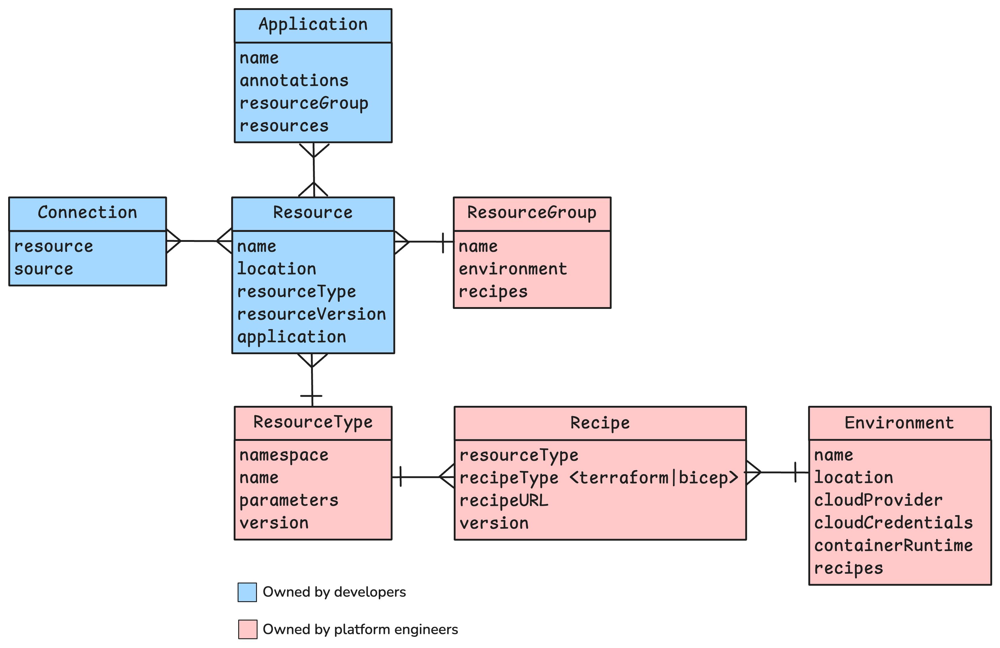
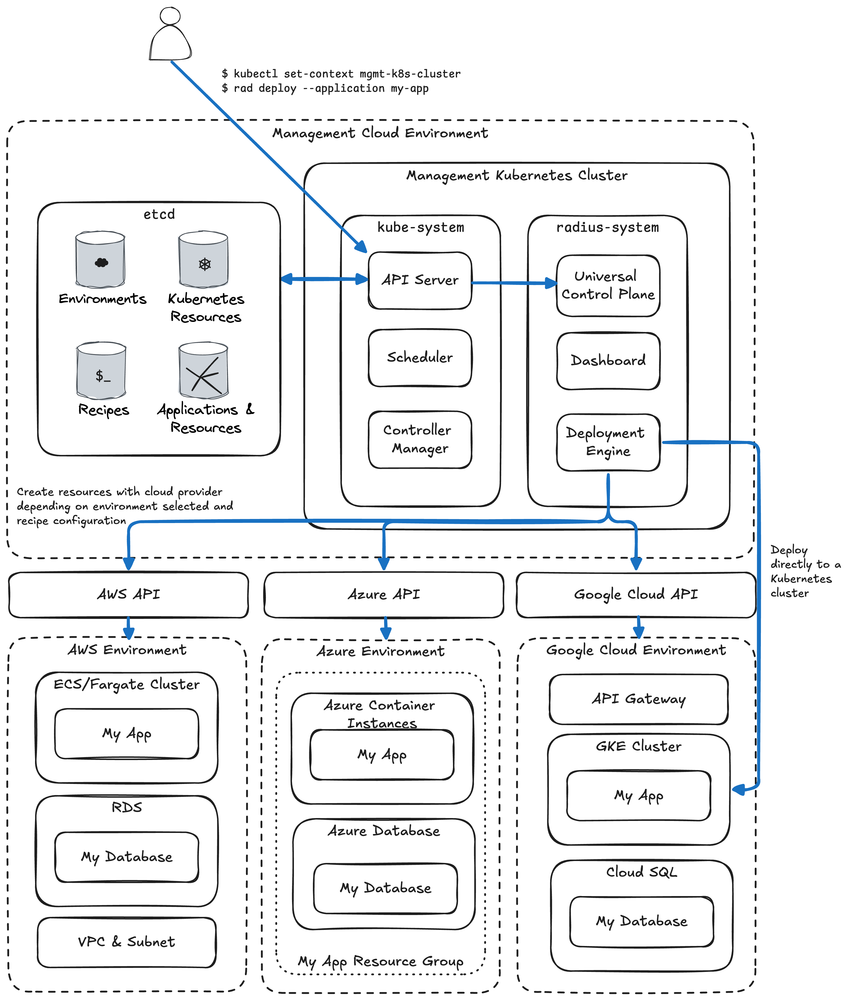

I recently joined the Azure Incubations team at Microsoft. In addition to Radius, the Azure Incubations team has helped build several open-source projects including [Dapr](https://dapr.io/), [KEDA](https://keda.sh/), and [Copacetic](https://project-copacetic.github.io/copacetic/website/), all of which are CNCF projects. Before joining the team, I knew very little about Radius aside from watching [Brendan Burns and Mark Russinovich talk about it](https://www.youtube.com/watch?v=gaG77PiYv5w). Over the last six weeks I've learned a lot about how Radius is built, what it can do today, and what is in store for the future. I suspect many readers of this blog are new to Radius just like I was, so let me share with you what I have learned.

## Why Radius

I've been working with large organizations for many years helping them adopt cloud-native technologies—mostly managing Kubernetes and serverless infrastructure. Each week, I try to talk with at least one large enterprise. This helps me keep a pulse on what challenges are top of mind in the community and what engineering efforts are a priority. I've noticed a few consistent challenges and trends which help me understand why Radius today.

**AI and the economy are putting a greater emphasis on efficiency and standardization** – The macro-economic environment in 2023 forced many organizations to lower their operational expenses. The emergence of large language models also resulted in huge new investments in AI. Combining these two trends with the fact that containers and cloud-native technologies have reached a high level of maturity helps explain why many companies are prioritizing efficiency and standardization of their cloud environments.

**Cloud is more than Kubernetes** – There is no need to convince this audience of the power of Kubernetes. It is highly customizable, there is a huge ecosystem around it, and it gives you portability between cloud environments. One thing it does not do is make it possible to provision and manage other cloud services such as managed databases, message queues, networks, and storage services. Teams are often using an infrastructure as code tool for these managed services and Kubernetes tooling for their application.

**Containers don't just run on Kubernetes** – Standing up and operating a production-ready Kubernetes environment is not exactly easy. Today, there are easier-to-operate platforms such as Azure Container Apps, Amazon ECS/Fargate, and Google CloudRun. I've talked with a surprising number of enterprises that are moving to these non-Kubernetes platforms for their low operational overhead and ease of use. Unfortunately, Kubernetes' portability does not help in this situation; it takes a significant amount of effort to move off Kubernetes. The opposite is true of organizations that start off by using Azure Functions or AWS Lambda, then their application outgrows the limitations of a function (e.g., the amount of CPU/memory or time limits are exceeded). Even if they packaged their function as a container, moving to another container platform is a challenge. In both cases, engineering teams are making long-term, difficult to reverse, platform decisions well before they have built their application, much less operated it in production.

**Platform engineering is being standardized** – Internal developer platforms have existed for many years. These platforms shield developers from having to know cloud infrastructure and Kubernetes in-depth as well as to provide CI/CD and observability capabilities. Internal development platforms have become more important as organizations prioritize enforcing security requirements and driving standardization and efficiency. The CNCF platform engineering landscape has also matured. Projects like Backstage, Crossplane, ArgoCD, Flux, and Terraform are popular building blocks. KubeCon has several co-located events including ArgoCon, BackstageCon, and Platform Engineering Day. And projects like [Cloud Native Operational Excellence](https://cnoe.io/) are starting up to help standardize how internal developer platforms are built. With these trends and challenges in mind, I've begun to build a vision in my mind of what Radius is and will be.

## My vision of Radius

After getting some hands-on time, talking with a few enterprise platform engineering teams, and getting a tutorial from a few Radius maintainers, I've built up my own personal vision for Radius: *Radius is as an application-centric, platform-agnostic, cloud resource manager. It decouples developer's application implementation and platform engineer's cloud infrastructure configuration*. That's a mouthful—let's unpack that ignoring for a moment what is possible today and what is on the roadmap. I will discuss what is possible today and what is on the roadmap later.

**Application centric** – Unlike similar tools, Radius is application centric. Rather than having to know cloud platform-specific details, developers build their application using a set of cloud building block resources published by the platform engineering team. These resources can be simple, such as a single container or a database, or they can be complex composite resources such as a *highly available auto-scaling web service with an API gateway, database, and memory cache*. Basic resource types ship with Radius today, but the most interesting resource types will come from community contributors or developed in-house to meet organizational-specific needs.

Since Radius has deep insight into each application, Radius can track dependencies between applications and application components. If you have ever operated a complex landscape of applications and infrastructure, you know how hard it is to understand dependencies. For example, a database outage can cause a ripple effect through multiple applications and affect many different business functions. When developers use Radius to model their application, Radius keeps track of connections between cloud resources and between other applications. This enables Radius to show operators an application graph showing dependencies across the entire landscape. This graph can be used to identify business impacts of even the smallest component outage and enrich data in incident management and observability systems.

**Platform agnostic** – Radius decouples the application implementation from the infrastructure implementation. Since the contract between developers and cloud environments is defined by a set of abstract resource types published by the platform engineering team, and not by which cloud provider is being used, Radius makes applications highly portable both between not only different cloud providers but between different container platforms.

**Cloud resource manager** – Radius manages cloud resources locally, in Azure, AWS, and in the future Google Cloud. When a platform engineer creates an environment in Radius, he or she also creates a recipe which implements each of the resource types. Radius recipes are very flexible. They can be implemented declaratively using existing Terraform modules or Bicep. Platform engineers can also perform operations pre- and post-deployment of resources using webhooks and Dapr workflows. Radius ships with recipes for managing out-of-the-box resource types on each cloud provider, but most platform engineering teams will customize these recipes to meet their organization's requirements. For example, a recipe could be written to deploy an Envoy proxy with mTLS enforced without any developer involvement.

## System Architecture

I'm fortunate enough to have had plenty of time to get hands-on with Radius. I will try to explain my understanding of the system through a series of diagrams.

### Usage workflow

Radius enforces a clear separation of duties between developers and platform engineers. You can see in the diagram below that the developer only writes one `app.bicep` file. When they deploy their application, they select which environment to deploy it to. Radius deploys the application to the selected environment which has customized recipes configured by the platform engineer.

### Logical Data Model

The diagram below shows the various objects and their relationships. I simplified some of the details for clarity, so this is not quite accurate with how Radius is implemented.

Applications and environments seem obvious, but the other objects are not. Let's walk through each one.

**Application** – This is a Radius object representing your application. Radius is not opinionated about how you define an application so it's up to you. It could be a small microservice or a complex set of containers, databases, message queues, etc. An application is modeled in Radius using the Bicep language, which is an open-source Infrastructure as Code (IaC) language for declaratively defining cloud resources.

**Resource** – A resource is an application component which is requested in the application's definition. Developers use resources to model their application. Each resource has a type and a version.

**Resource Type** – Radius ships with several [resource types out of the box](https://docs.radapp.io/guides/author-apps/portable-resources/overview/). Out-of-the-box resource types include `Application.Core/containers` and `Application.Core/mongoDatabases` for example. Or it could be a resource type you have added to your Radius configuration from another community member, or a resource type you have defined and customized for your organization.

**Resource Group** – If you are an Azure user, you may be familiar with Azure resource groups. Radius takes inspiration from these resource groups, and Radius' resource groups are similar. Radius resource groups are a logical grouping of applications and their resources. When you deploy an application with Radius, you choose which resource group to place it in.

**Connection** – Above, I talked about the benefits of Radius to operational teams because it tracks dependencies. Connections are how those dependencies are modeled. Each connection denotes which parent resource is connected to, or depends upon, which source resource.

**Environment** – Environments are straight forward. They can be your local workstation, an Azure subscription, an AWS account, or a Google Cloud project.

**Recipe** – I talked about recipes quite a bit in the mental model section. The only thing to emphasize here is that a recipe is specific to an environment. You could have different sets of recipes for a test environment versus a production environment. In the Envoy mTLS example, a recipe could be written for a test environment that does not deploy an Envoy proxy, but the production environment does without the developer having to worry about Envoy at all.

### Deployment Model

One of my first questions was what does a Radius deployment actually look like? The diagram below shows a management environment where Radius runs and several application environments. In this example, Radius deploys applications to AWS, Azure, and Google Cloud. Each cloud environment can be configured differently using recipes. You can see that in AWS, Radius is deploying the application to ECS/Fargate, creating an RDS database, and configuring the VPC. In Azure, Radius is creating a resource group for the application, then deploying it using Azure Container Apps and Azure Database. Finally, in Google Cloud, Radius is deploying the application using the Kubernetes API to a GKE cluster and creating a Cloud SQL database and API Gateway.

Remember that in all three of these deployment scenarios, the developer never has to know these details. The application definition never changes. In all scenarios, the developer's containers are deployed along with a database, e.g., PostgreSQL. It is the platform engineer who configures the recipes for each cloud environment.

In addition to deploying the application's containers and databases, recipes can also be used to configure IAM, storage encryption keys, firewall rules, etc. Recipes can be used to tag resources with application metadata to enable cost attribution for example. Since Radius uses Terraform and Bicep to deploy resources, it is up to you how complex you want to make your recipes.

There are a few other interesting, non-obvious things about how Radius is deployed. You will notice that when the user deploys the application, the Radius CLI makes an API call to the Kubernetes API server for cluster running Radius. This is because Radius uses the [Kubernetes API aggregation layer](https://kubernetes.io/docs/concepts/extend-kubernetes/api-extension/apiserver-aggregation/). This means that the Kubernetes API server proxies API calls to Radius' control plane running on the same cluster. This also means that identity and RBAC is handled by Kubernetes. When you deploy an application using Radius, the Radius control plane (called the Universal Control Plane) creates applications and resources which are stored in the same etcd as the Kubernetes control plane.

## Radius Roadmap

So far, we have ignored what is possible today and what is coming. There are several features discussed here which are not available today, but are on the roadmap including:

- The ability to define your own resource types is very basic today. Developers can use the [extender resource type](https://docs.radapp.io/reference/resource-schema/core-schema/extender/) and specify their own recipe. This breaks the hard separation between developer and platform engineer. The ability to specify types beyond the extender type is under development now. You can read more in the [user-defined types technical design](https://github.com/radius-project/design-notes/blob/main/architecture/2024-07-user-defined-types.md).

- Radius will only deploy containers to the same Kubernetes cluster that is running Radius today. The ability to deploy to [other Kubernetes clusters](https://github.com/orgs/radius-project/projects/8/views/1?pane=issue&itemId=55074612&issue=radius-project%7Croadmap%7C42) and to other [serverless container platforms](https://github.com/radius-project/roadmap/issues/23) are on the roadmap.

- Radius can only deploy to a local developer workstation, Azure, and AWS. Support for Google Cloud is on the [roadmap](https://github.com/orgs/radius-project/projects/8/views/1?pane=issue&itemId=49752139&issue=radius-project%7Croadmap%7C38).

- While you can use Terraform and Bicep to deploy cloud resources today, we are implementing several enhancements to make deploying resources more powerful and flexible including using Dapr workflows as part of your recipe.

You can monitor the Radius roadmap on the [Radius GitHub](https://github.com/orgs/radius-project/projects/8/views/1) page.

## What's Next for Me

There is still a lot for me to learn. I plan to spend more hands-on time modeling existing applications with Radius. The [eShop example](https://docs.radapp.io/tutorials/eshop/) seems like a good real-world application to start with. I also want to learn more about [Dapr](https://dapr.io/). It seems like combining Dapr with Radius is a powerful combination.

I hope this blog post was helpful for others new to Radius. I'm very excited about where we can take Radius. If you have ideas or want to get involved in the project, visit the [Radius Community](https://github.com/radius-project/community) page to learn about our community calls and Discord channel. Or if you have questions or ideas for me, feel free to reach out on [X](https://x.com/zachcasperatx) or [LinkedIn](https://www.linkedin.com/in/zcasper/).
