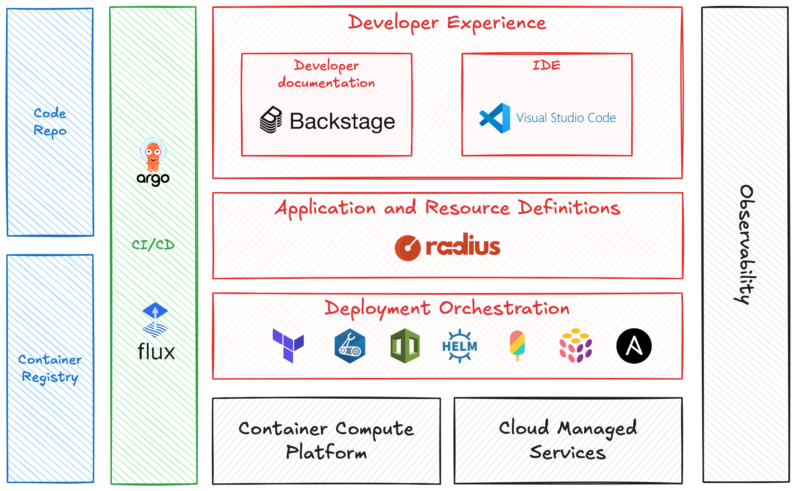

# Radius enables application-centric internal developer platforms

Very early in my career I worked on a long-forgotten system called the HP-3000. I wrote batch processing applications in Pascal to process financial transactions. Then I transitioned to being a web application developer. Moving from the world where each batch application had a single executable and maybe a few shared libraries to the world of web applications was a big change. I remember trying to wrap my head around how it all worked. There were so many different applications all communicating with other applications. Of course, I quickly learned that it was a simple model-view-controller pattern, and the application was just a collection of binaries and HTML templates.

Roll forward twenty-five years and developers today have the same experience, just on steroids. Cloud-native applications are composed of so many resources—containers, pods, services, databases, message queues, blob storage, secrets, and so on. And of course if you look at the cloud infrastructure needed to host these applications, it gets incredible complex very quickly.

When I look at the AWS console or a resource group in the Azure portal, I most definitely do not see anything resembling what I would traditionally consider an application. For example, here is what the Azure portal looks like after deploying a moderately complex application, [TraderX](https://github.com/finos/traderX/tree/main).

I see lots of stuff that TraderX depends upon, but where is the TraderX application? Maybe the new Kubernetes GUI [Headlamp](https://headlamp.dev/) will give us a better view of my application?

Even on the Workloads tab, there is no application. I would show you the AWS console, but you all know what that's going to be like. As time goes on and technology progresses our applications have become more complex, more distributed, and less easy to define. 

Compounding this trend, the platforms we use to run our applications have also gotten more complex, more distributed, and less easy to define. Modern cloud platforms including AWS, Azure, Google Cloud, and Kubernetes were built bottom-up and infrastructure centric. But developers build applications top-down and user centric.

This bias towards infrastructure has made it hard on developers. Not only are developers today expected to be experts in their users' needs, their programming language, and their application architecture, but they also must master a mix of Kubernetes, AWS, Azure, and Google Cloud. 

### Internal Developer Platforms Today

Bringing the gap between developers and infrastructure is one of the many jobs of platform engineers and internal developer platforms (IDPs). The majority of IDPs are using a combination of many components:

* Backstage as a developer portal
* Helm, Terraform, or other infrastructure as code language
* Kubernetes
* A CI/CD system such as ArgoCD
* A Git repository and container registry

Of course there are so many other components and capabilities that could be added to an IDP. The [CNOE project](https://cnoe.io/docs/intro/technology) is a great example of a reference architecture and reference implementation. CNOE is a great starting point for building an IDP. But it is also emblematic of the challenges discussed earlier. It's very infrastructure centric and developers are expected to author Terraform configurations and/or Crossplane compositions.

Ideally, developers want:

* To focus on their users and their application as much as possible and not their application's infrastructure
* High quality developer documentation for using the IDP which include reference information, examples, and who to contact for help
* Confidence that their application will run as expected whether the application is running locally or in the cloud environment
* A dashboard for visualizing their application and application resources and how they are deployed
* An integrated development environment with extensions for using the IDP

## An Application-Centric IDP

A common approach platform engineers take to meet these requirements is to define an application manifest file structure and build machinery to parse the manifest and deploy the application. Many organizations have tried using custom Terraform modules and providers or attempted to use the Open Application Model (OAM) and/or Kubevella. Others are looking to use Kubernetes as their control plane for everything and implement Crossplane, AWS Controllers for Kubernetes (ACK), Azure Service Operator (ASO), or Google Config Connector (they all follow the same pattern).

There is a ton of benefits to doing this:

* Organizations can rationalize all their cloud resources by connecting it back to a canonical application resource (not just a label or annotation)
* All developers within the organization are using the same set of resource types defined by the platform engineers
* These resource types are specific to the organization and customized to meet the organization's structure, workflow, and culture; maybe the resource types are high level abstractions with minimal knobs and levers, or maybe they are foundational with tons of customization options
* Since the resource types are agnostic of the implementation, developers never have to write Helm charts, CloudFormation templates, Bicep templates, or Terraform configurations

The challenge is that there is no common solution in the cloud-native ecosystem for implementing this. There are so many different tools for deploying applications (CloudFormation, Terraform, Bicep, Google Deployment Manager, Crossplane, Pulumi, Ansible, etc.), and each one has different capabilities building a great developer experience. We've heard from many platform teams who have attempted this model and they have told us time and again how hard it is.

## Application and Resource Definitions

That's where Radius comes in. We are building Radius to be a cloud provider- and container platform-agnostic application and resource definition solution for building application-centric IDPs.

Over the next several months, you will hear more about our vision for how Radius can help organizations build application-centric internal developer platforms. If you have joined any of our community meetings, you have already heard about our first steps by making Radius resource types extensible. We can't wait to share with our community more examples about using Radius resource types and recipes to create complex composite resource types and integrating those into VS Code to build powerful and customized developer experiences.

## Learn More and Contribute

If you are a developer who is interested in making it easier to build cloud-native applications, we would love for you to get involved with the Radius project. Your perspective is immensely valuable. If you are a platform engineer, we invite you to join us in building Radius, so it is easy to make your internal developer platform application centric.

* Join our monthly community meeting to see demos and hear the latest updates (join the [Radius Google Group](https://groups.google.com/g/radapp_io) to get email announcements)
* Join the discussion or ask for help on the [Radius Discord server](https://aka.ms/radius/discord)
* Subscribe to the [Radius YouTube channel](https://www.youtube.com/@radapp_io) for more demos
