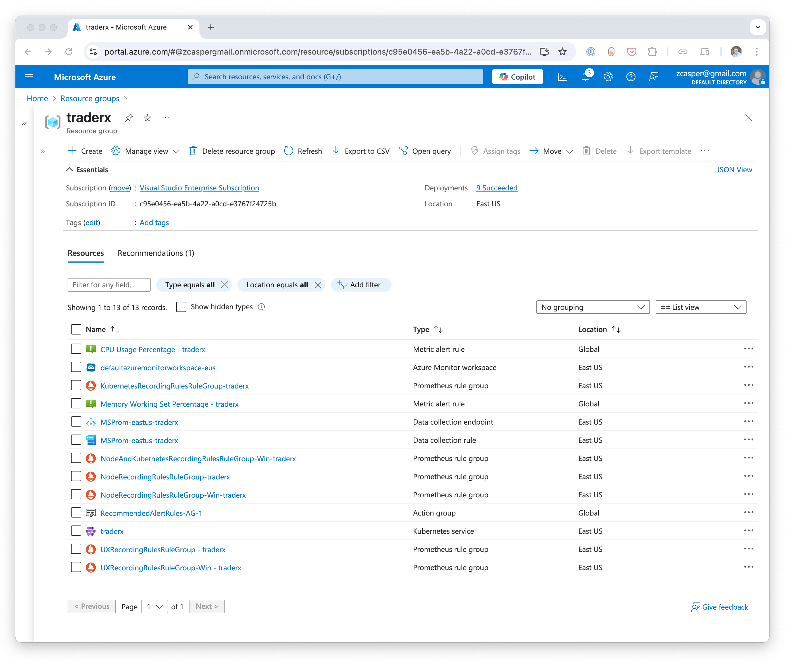
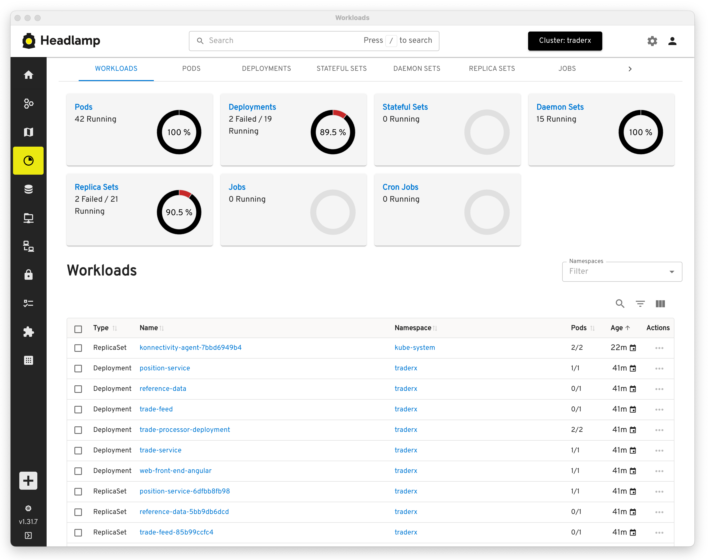
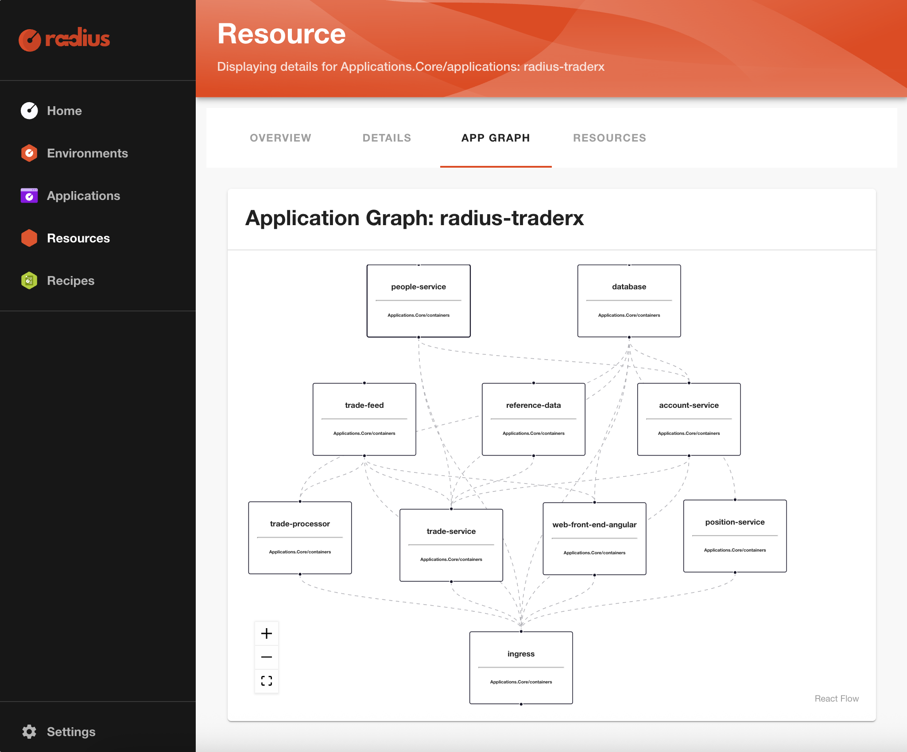
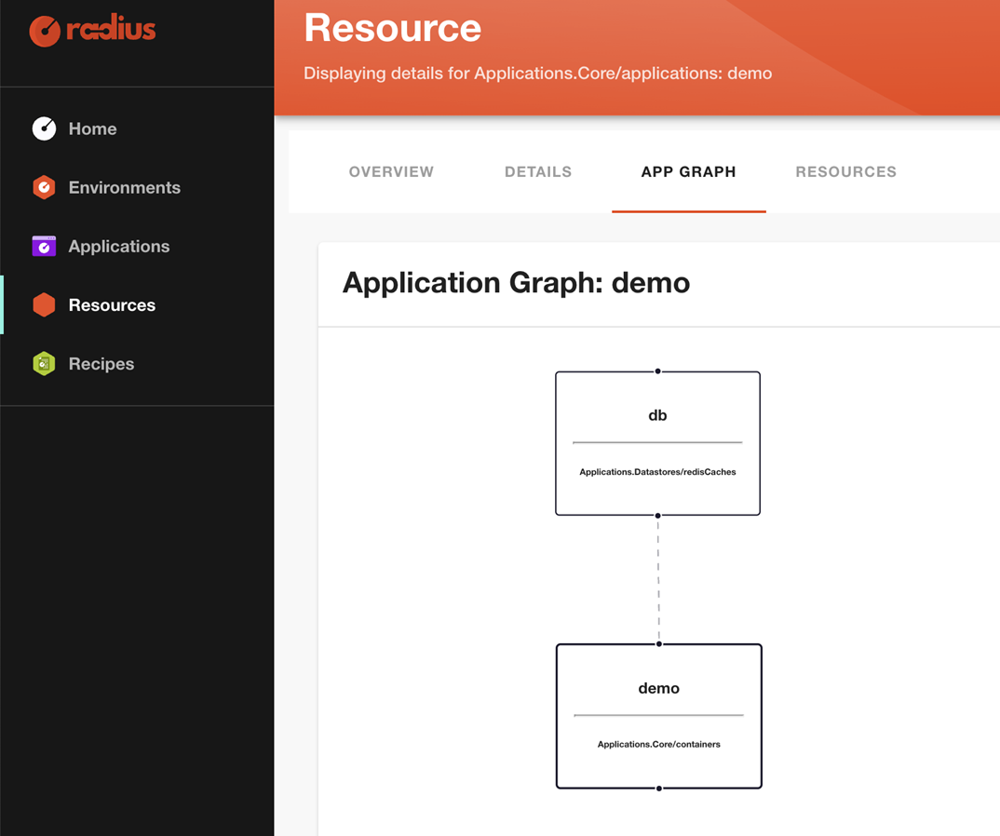
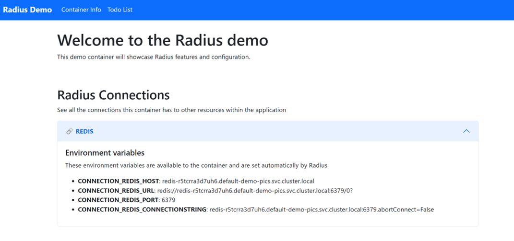

Very early in my career I worked on a long-forgotten system called the HP-3000. I wrote batch processing applications in Pascal to process financial transactions. Then I transitioned to being a web application developer. Moving from the world where each batch application had a single executable and maybe a few shared libraries to the world of web applications was a big change. I remember trying to wrap my head around how it all worked. There were so many different applications all communicating with other applications. Of course, I quickly learned that it was a simple model-view-controller pattern, and the application was just a collection of binaries and HTML templates.

Roll forward twenty-five years and developers today have the same experience, just on steroids. Cloud-native applications are composed of so many resources—containers, pods, services, databases, message queues, blob storage, secrets, and so on. And of course if you look at the cloud infrastructure needed to host these applications, it gets incredibly complex very quickly.

When I look at the AWS console or a resource group in the Azure portal, I most definitely do not see anything resembling what I would traditionally consider an application. For example, here is what the Azure portal looks like after deploying a moderately complex application, [TraderX](https://github.com/finos/traderX/tree/main).



I see lots of stuff TraderX depends upon, but where is the TraderX application? Maybe the cool new Kubernetes GUI, [Headlamp](https://headlamp.dev/), will give us a better view of my application?



Even on the Workloads tab, there is no application. I would show you the AWS console, but you all know what that's going to be like. As time goes on and technology progresses our applications have become more complex, more distributed, and harder to define. 

Compounding this trend, the platforms we use to run our applications have also gotten more complex, more distributed, and less easy to define. Modern cloud platforms including AWS, Azure, Google Cloud, and Kubernetes were built bottom-up and infrastructure centric. But developers build applications top-down and user centric.

What if, instead of seeing infrastructure components in your cloud console, or Kubernetes Pods and Services, we had a console that showed developers and operators their _applications_?



That's why we built Radius: To make it easy for Platform Engineers to ensure their IDPs give developers and operators a more application-centric experience. 

Radius provides platform engineers an open-source, cloud agnostic, application platform.  Radius can be integrated into internal developer platforms (IDPs) to give developers a more application centric experience.  For more context regarding how Radius relates to other open-source projects used by platform engineers, please see [Platform Engineering with Radius at KubeCon London 2025](https://blog.radapp.io/posts/2025/04/24/platform-engineering-with-radius-at-kubecon-london-2025/.)

## Application Centric Developer Experience with Radius

Let’s take a look at the specifics of the application-centric developer experience when creating a Radius application.  Radius provides an application-centric experience in two basic ways: 

1. Radius allows developers to focus entirely on their application without intermingling cloud infrastructure concepts within their application.  Specifically, Radius enables defining an application once and deploying it across clouds (private cloud, AWS, Azure), without the developer having to understand the nuances of each.  Radius also provides consistent syntax for defining application resources whether they run in the cloud (like AWS MemoryDB) or on Kubernetes (like a frontend container). 

2. An output of every Radius application deployment is an application graph, just like the graph of the TraderX app shown above.  So, the developer and other members of an enterprise application team all understand exactly what the application is, all of it’s software and infrastructure components sand how they are all connected.  The graph makes very clear what the application is and all of its component dependencies. 

To better understand this application-centric experience, imagine you are an enterprise application developer very familiar with writing and containerizing runtime application code but not familiar with cloud infrastructure deployment and configuration.  You want to just describe your application and deploy it to whatever cloud your company prefers, whether private-cloud, AWS or Azure.  To provide this experience in a real-world scenario, your infrastructure operator would configure your Radius environment to enable the following developer experience.  More on this later.  For now, we’ll just walk through a simple example that you can try out yourself at the [Radius Getting Started Guide](https://docs.radapp.io/getting-started).

We’ll start with the description of a very simple ToDo list application that includes only two resources: a frontend container and a Redis cache.  These resource types are both natively supported in Radius. (In a future post, we’ll explain how to extend Radius by adding your own custom resource types).  Here's the Radius application description, which is written in the Bicep language:

```bicep
//This is a Radius application file named app.bicep.

// Import the set of Radius resources (Applications.*) into Bicep
extension radius

@description('The app ID of your Radius Application. Set automatically by the rad CLI.')
param application string

//This is a frontend container named 'demo'
resource demo 'Applications.Core/containers@2023-10-01-preview' = {
  name: 'demo'
  properties: {
    application: application
    container: {
      image: 'ghcr.io/radius-project/samples/demo:latest'
      ports: {
        web: {
          containerPort: 3000
        }
      }
    }
//The following connection makes it easy to connect this frontend container 
// to the database defined further below
    connections: {
      redis: {
        source: db.id
      }
    }
  }
}

param environment string
//This is the definition of the database resource, named 'db'.
//It is a Redis cache, which is a type of datastore.
resource db 'Applications.Datastores/redisCaches@2023-10-01-preview' = {
  name: 'db'
  properties: {
    application: application
    environment: environment
  }
}
```
You can see the frontend container (`demo`) in this application is created using the `resource` key word, which just tells Radius to create an application resource, in this case one of type container.  This container has only a few parameters, including a container image file and a container port.  The container also includes a Radius “connection,” which is a powerful feature.  Connections enable Radius to do a lot of work behind the scenes for the developer, including showing explicit connections in an application graph, like the TraderX application graph pictured above. With connections, Radius also automatically injects details like connection strings and credentials into the container as environment variables. This tells the container how to connect to Redis no matter where Redis is deployed (on-premise, on AWS or on Azure) so the developer doesn’t have to grapple with all of these details.  

It's also very easy for the developer to add a database to this application. The developer creates a resource named `db` of type redisCaches with only an application and an environment parameter.  Per the connection defined in the frontend container above, `db` is explicitly connected to the frontend container, `demo`.   Notice that even though the container is a kubernetes specific resource and redis is a service that can run in any cloud environment, the syntax for creating both the container and the Redis cache is consistent. 

That’s it!  Your first Radius application is ready to deploy! 
But, before we look at the deployment experience, let’s pause to highlight some things you do *not* see in this Radius application definition: Beyond creating a redis resource named `db`, there are no infrastructure details.  As a developer, you are not concerned about how Redis is configured and deployed, how your application will authenticate to Redis, how Redis connects to your frontend container, or even where Redis will ultimately run (on-premise, AWS or Azure).  You just say you need Redis and you need it connected to your frontend container, and Radius uses a feature called [Recipes](https://docs.radapp.io/guides/recipes/overview/) to do the rest.  That’s a big reason for why we say Radius provides an application centric experience: Developers focus entirely on their applications, not on the details of underlying infrastructure deployment and configuration. 

Now, here’s the deployment experience using the Radius CLI.  (In a real world scenario, Radius application deployments would more likely happen via a GitOps tool like Flux or ArgoCD.  We’ll discuss Radius integration with GitOps tools in a future post).  To deploy this application to, say, your default local environment, from the rad CLI, you would run 

```bash
rad run app.bicep
```
The run command deploys the application and it sets up port forwarding so you can: 

1. Browse the applications graph at [https://localhost:7007](https://localhost:7007), which is a Backstage based Dashboard that allows you to browse all the details of your Radius application. The application graph is created every time you deploy a Radius application. So, you can always easily see the application you deployed, the resources that make up that application, including all of its dependent infrastructure.

2. Browse the actual running application at [https://localhost:3000](https://localhost:3000).


Let’s first take a look at the application graph at [https://localhost:7007](https://localhost:7007). 




This application graph shows only two nodes: the frontend container and the Redis cache defined in the `app.bicep` file above.  The two resources are explicitly connected to each other per the  `connection` property discussed above.  Radius application graphs are as simple or as rich as the application they describe, as we saw in the TraderX application graph above.  Regardless, the graph makes it trivial to visualize any application you have deployed, which contributes to a more application-centric experience for developers and their operator and SRE counterparts. 

Navigating to the actual running application at [https://localhost:3000](https://localhost:3000), we see 



The ToDo list application has a Container Info tab that shows all of the environment variables Radius automatically created inside of the container based on the `connection` property in the Radius application description.  When writing this Radius application, the developer was focused on declaring the intent to have the frontend container and the Redis connected but then Radius took care of these connection details behind the scenes.

Lastly, let’s take a look at the deployment experience for deploying the same todo list application to Amazon Web Services and Azure.  This experience is completely consistent with the local deployment above, the developer just changes the target Radius environment for the application deployment.  Above the target was a default local environment.  Below assumes your Radius environment for Amazon Web Services is named aws, and your environment for Azure is named azure.

To deploy the application unchanged to AWS you would run 
```bash
rad deploy app.bicep --environment aws
```
To deploy the application unchanged to Azure you would run 
```bash
rad deploy app.bicep --environment azure 
```
In both cases, the application is deployed to the target cloud environment without the developer having to make environment specific changes to the application description.

## Recipes

The application-centric experience described above is largely enabled by a Radius feature called [Recipes](https://docs.radapp.io/guides/recipes/overview/). In a future post, we’ll explain Recipes (which are written in either Terraform or Bicep), how they enable the developer experience described above and how they are authored by infrastructure operators.

## Conclusion

Radius is an open source, cloud agnostic application platform that you can integrate into your internal developer platform (IDP) to provide an application centric experience for your developers.  Radius enables app-centricity in two basic ways:

1. Radius allows developers to focus entirely on their application without intermingling cloud infrastructure concepts within their application.  Specifically, Radius enables defining an application once and deploying it across clouds (private cloud, AWS, Azure), without the developer having to understand the nuances of each.  Radius also provides consistent syntax for defining application resources whether they run in the cloud (like AWS MemoryDB) or on Kubernetes (like a frontend container). 

2. An output of every Radius application deployment is an application graph, just like the graph of the TraderX app shown above.  So, the developer and other members of an enterprise application team all understand exactly what the application is, all of it’s software and infrastructure components sand how they are all connected.  The graph makes very clear what the application is and all of its component dependencies. 

To replicate the steps for deploying the simple Radius discussed above, please try the [Radius Getting Started Guide](https://docs.radapp.io/getting-started).

## Learn More and Contribute

If you are a platform engineer, we invite you to try using Radius in your internal developer platform to provide a more application centric experience.
We also invite everyone in the open source community to get involved with the Radius project. Your perspective and contributions are immensely valuable. 

* Join our monthly community meeting to see demos and hear the latest updates (join the [Radius Google Group](https://groups.google.com/g/radapp_io) to get email announcements)
* Join the discussion or ask for help on the [Radius Discord server](https://aka.ms/radius/discord)
* Subscribe to the [Radius YouTube channel](https://www.youtube.com/@radapp_io) for more demos
