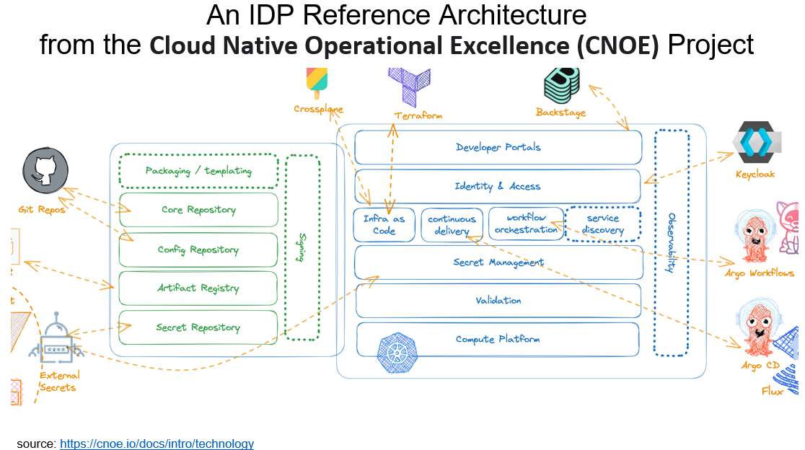
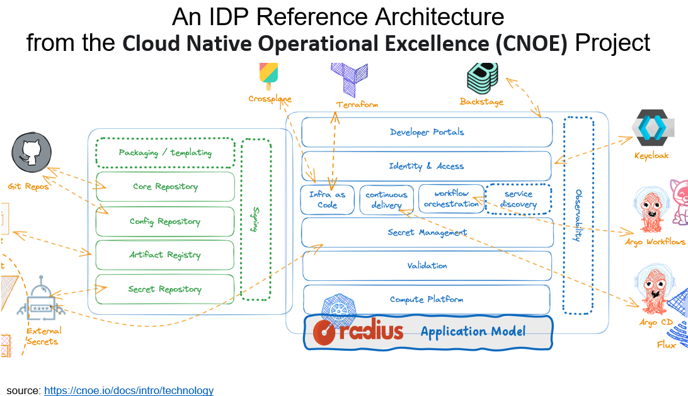

I had a great time at KubeCon London earlier this month presenting and demoing Radius and meeting members of the Radius community!  Thanks to everyone for taking time to stop by and chat. It was very fun to meet so many community members in person versus over video conference. 😊

As anyone familiar with Radius, platform engineers are the primary focus for the Radius maintainers. That’s because so many Radius early adopters are platform engineering teams who are integrating Radius into their internal developer platforms (IDPs). A great example is Nuno Guedes and his platform engineering team at Millenium bcp (the largest private bank in Portugal). The Millenium bcp team has integrated Radius into their IDP and have been using it in production since December 2024. Nuno is the head of cloud at Millenium bcp and he and I co-presented on his use of Radius at KubeCon London. To learn more about how the Millenium bcp team is using Radius in their IDP, please check out our joint presentation *How Millenium bcp Leverages Radius to Empower Developer + Operator Collaboration* ([CNCF YouTube channel](https://www.youtube.com/watch?v=ZmcZlDCYDgE) | [Slides from presentation](images/kubecon-london-radius-presentation.pdf)).

Also please check out the [Radius YouTube channel](https://www.youtube.com/@radapp_io) where you can see the demos I show in the presentation:

* [Demo 1 - Deploy a Radius Application Across on-premise and AWS](https://youtu.be/gFTw2TDI80w)

* [Demo 2 - Extending Radius with Resource Types](https://www.youtube.com/watch?v=3zREEbewbVo)

A recurring theme from this presentation and many other conversations that I had at KubeCon is how Radius enables platform engineers to provide an application-centric experience to through their IDPs. I have the good fortune to work with so many platform engineering teams from around the world. Those teams have taught me a ton about the problems they are solving via for enterprise application teams via custom IDPs, the challenges they face, and the increasingly rich ecosystem of open-source technologies they leverage in their day-to-day work. This diagram from CNOE (as snipped from the slide deck above) does a great job as a reference architecture including common open-source technologies used to build IDPs. Many platform teams use open-source technologies like Kubernetes for their compute platform, Terraform for infrastructure as code, Backstage as the UI framework for their developer portals, ArgoCD or Flux for GitOps workflows, etc.

Radius maintainers, along with and our platform engineering early adopters found common cause around an important concept and technology that is *missing* in this landscape: the notion of what you can think of as an “application model,” or an “application platform.” That gap matters a lot, because developers live and breathe applications: It’s what they design, build, support. It’s a what they reason about. But, in the world of distributed systems and cloud native technologies, it’s gotten increasingly difficult to reason about an application as an entity or even agree on what an application is and what its boundaries are. That ambiguity, in addition to the myriad challenges with cloud development, just further increases the cognitive load developers struggle with, and which IDPs are explicitly designed to reduce. Platform engineers require an open-source project to draw from, along with those illustrated above, that allows them to build an application-centric developer experience. That’s where Radius comes in: Radius is the application model platform engineers use to provide an application-centric developer experience integrated with other key open-source technologies used in their IDPs like Terraform, Flux, and Backstage.

Radius is open-source (CNCF), it is cloud-agnostic and it allows you to create custom application resources tailored precisely to the needs of your developers. 

Please watch the [KubeCon presentation from Millenium bcp](https://www.youtube.com/watch?v=ZmcZlDCYDgE) mentioned above. And watch this blog for future posts on how Radius is used by platform engineers in IDPs to: 

* Provide an application-centric experience for enterprise application developers

* Enable better collaboration across application developers and infrastructure operators

* Create custom Radius application resources and publish them to a Backstage catalog

* Deploy Radius application as part of GitOps workflows using Flux or ArgoCD

* Deploy the same Radius application, unchanged, across 
  * Clouds: on-premises, AWS, and Azure
  * Runtimes: Kubernetes and serverless container runtimes like Azure Container Instances and AWS Elastic Container Services

## Learn More and Contribute

We would love for you to join us to help build Radius:

* Join our monthly community meeting to see demos and hear the latest updates (join the [Radius Google Group](https://groups.google.com/g/radapp_io) to get email announcements)
* Join the discussion or ask for help on the [Radius Discord server](https://aka.ms/radius/discord)
* Subscribe to the [Radius YouTube channel](https://www.youtube.com/@radapp_io) for more demos
